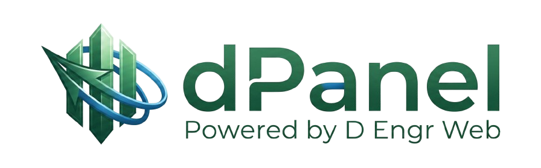
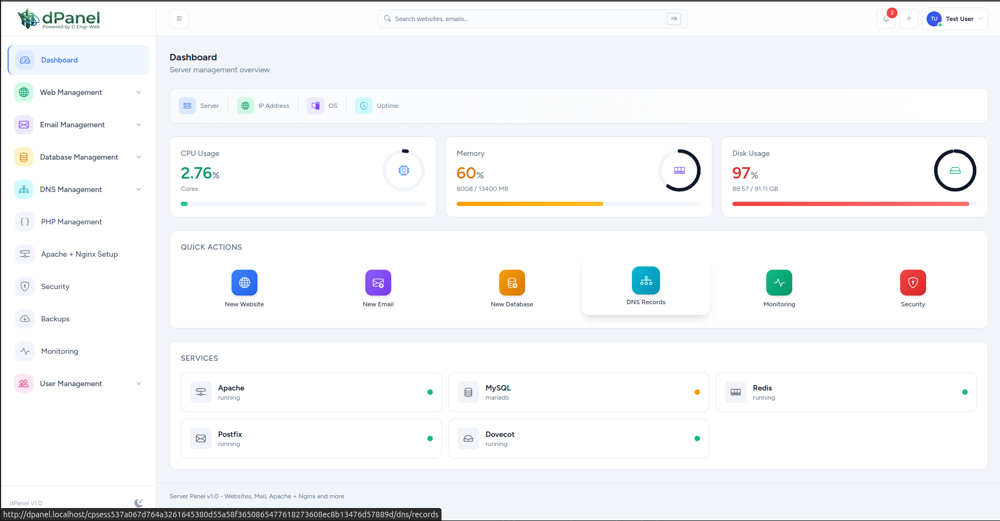
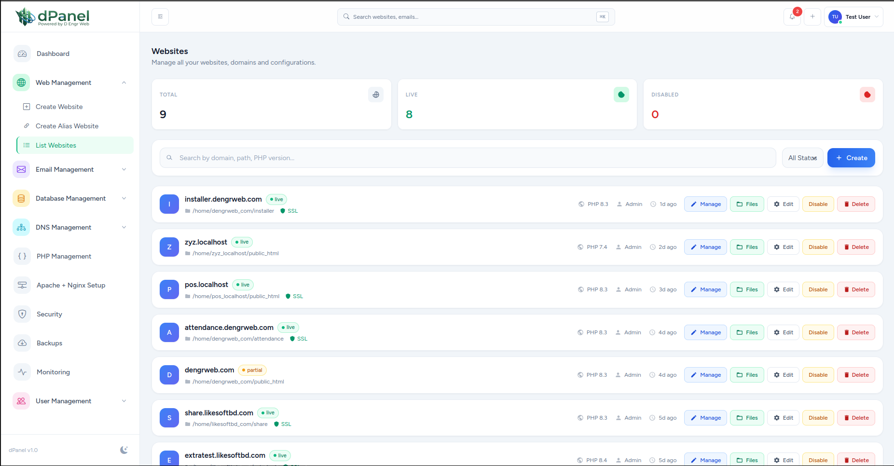
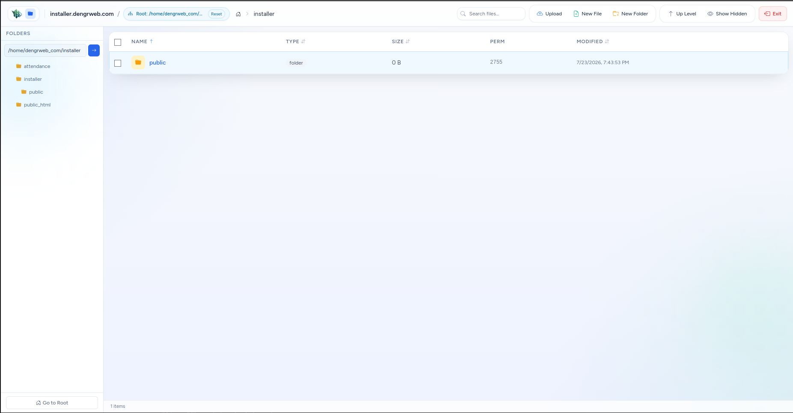
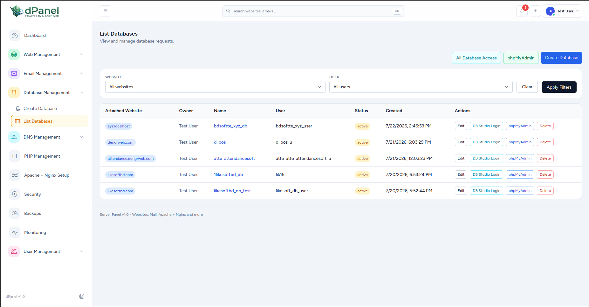
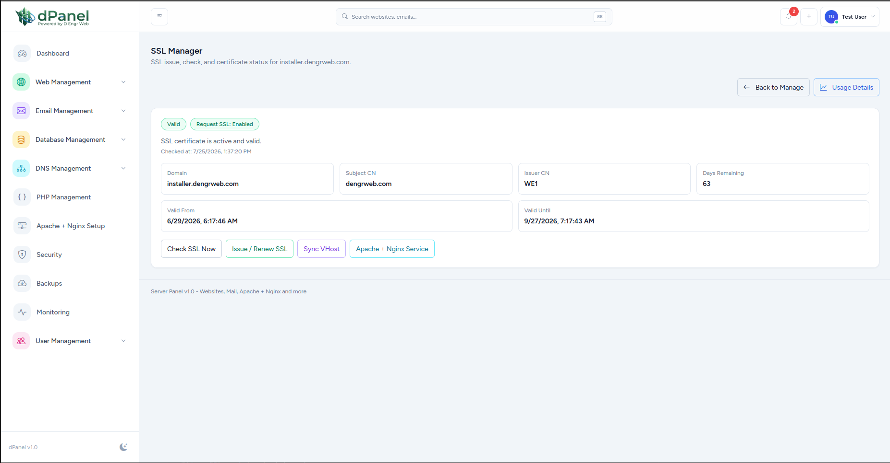
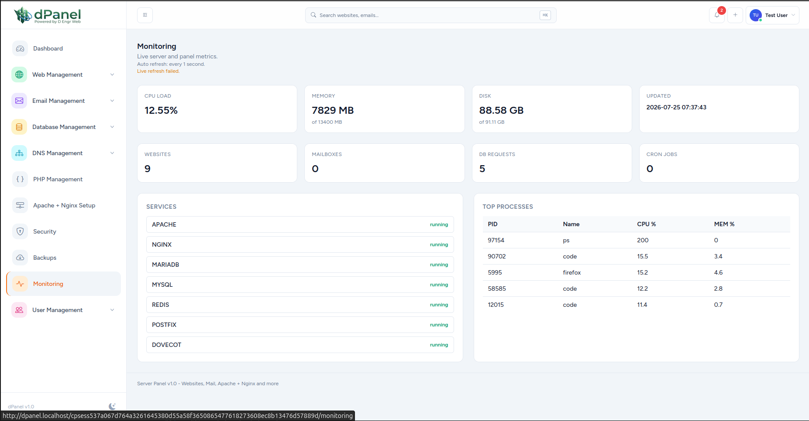

# dPanel



dPanel is a free-to-use, source-available ServerPanel hosting control panel
stack for managing websites, PHP runtimes, SSL, databases, file management,
mail, backups, monitoring, and server automation.

## Project Screenshots

Add final screenshots under `docs/assets/screenshots/` and keep the same names
below so this section becomes live automatically.

| Dashboard | Websites | File Manager |
| --- | --- | --- |
|  |  |  |

| Databases | SSL Manager | Server Tasks |
| --- | --- | --- |
|  |  |  |

## What Is Included

- `dpanel` - Laravel 12 + Vue/Inertia control panel application
- `drust` - Rust localhost execution API for privileged server operations
- `dscript` - installer, bootstrap, update, and recovery scripts
- `phpmyadmin` - bundled phpMyAdmin integration assets
- `docs` - public docs and first-run repair references

Core feature areas:

- Website and domain management
- PHP runtime and web-stack control
- SSL certificate lifecycle
- Database and database-user workflows
- File manager with permission repair support
- Mail domain and mailbox management
- Backup scheduling and restore workflow groundwork
- Server task history, command reports, and AI-assisted error suggestions
- Monitoring, service status, and audit-log groundwork

Canonical installed paths:

- Panel app: `/var/www/dpanel`
- Execution API: `/var/www/drust`
- Script repo: `/var/www/dscript`

## Final Destination

dPanel is being built as a practical self-hosted hosting control panel for
operators, developers, agencies, and small hosting providers who need one place
to manage websites, databases, SSL, files, backups, mail, and server repair
tasks without losing control of the underlying Linux server.

The intended production shape is:

```text
Browser
  -> dpanel: Laravel + Vue control panel
  -> drust: protected localhost execution API
  -> Linux services: nginx, Apache, PHP-FPM, MariaDB, Redis, certbot, filesystem

dscript remains available for installation, bootstrap, update, and recovery.
```

## Installer Guide

Run the installer from a fresh server with `curl`:

```bash
curl -fsSL https://installer.dengrweb.com/installer.sh -o installer.sh
chmod +x installer.sh
sudo ./installer.sh
```

For module-specific installs or updates:

```bash
sudo ./installer.sh nginx php mariadb
sudo ./installer.sh update
```

Full install, command, module, and recovery details are in
[`dscript/guide.md`](dscript/guide.md).

## Later Roadmap

- Improve first-time install reliability on fresh Ubuntu/Debian servers.
- Expand file manager permission diagnostics and repair coverage.
- Add clearer UI states for API failures, task errors, and repair suggestions.
- Harden website provisioning, vhost sync, and rollback flows.
- Improve SSL issuance and renewal visibility.
- Expand database user, privilege, DNS, and mail management helpers.
- Improve backup scheduling, restore workflows, monitoring, and alerting.
- Add stronger audit trails for privileged actions.
- Add more automated checks for Laravel, Rust, docs, and scripts.
- Add real architecture diagrams, release packaging notes, and screenshots.

See the full roadmap in [`ROADMAP.md`](ROADMAP.md).

## Quick Connections

- Developer guide: [`DEVELOPER.md`](DEVELOPER.md)
- Contribution guide: [`CONTRIBUTING.md`](CONTRIBUTING.md)
- Security policy: [`SECURITY.md`](SECURITY.md)
- License policy: [`LICENSE`](LICENSE)
- Changelog: [`CHANGELOG.md`](CHANGELOG.md)
- First install and permission repair: [`docs/FIRST_INSTALL_AND_PERMISSIONS.md`](docs/FIRST_INSTALL_AND_PERMISSIONS.md)
- Script command guide: [`dscript/guide.md`](dscript/guide.md)

## Developer Notes

Keep responsibilities separated:

- `dpanel` owns UI, database records, authorization, queues, and user workflows.
- `drust` owns privileged localhost server operations.
- `dscript` owns install, bootstrap, and recovery commands.

Laravel should not directly run unsafe privileged shell commands for production
server changes. Add host-level actions to `drust` and call them from `dpanel`
through a service or queued job.

## Contributor Notes

Before contributing, read [`CONTRIBUTING.md`](CONTRIBUTING.md),
[`DEVELOPER.md`](DEVELOPER.md), [`SECURITY.md`](SECURITY.md), and
[`LICENSE`](LICENSE).

Do not submit secrets, `.env` files, private keys, database dumps, customer
data, generated dependency folders, or proprietary code you do not have
permission to contribute.

## Security

Please do not open public issues for security vulnerabilities. Follow
[`SECURITY.md`](SECURITY.md) and report privately with reproduction details.

Security-sensitive areas include:

- authentication and authorization
- file manager path validation
- `drust` API token handling
- command execution
- SSH keys and credentials
- database provisioning
- SSL private keys
- permissions and ownership repair

`drust` must stay localhost-only, bearer-token protected, and unavailable from
the public internet.

## License

dPanel is free to use under a custom source-available license. Public
modification, redistribution, rebranding, resale, or derivative works are not
allowed without written permission. You may sell hosting, website management,
server management, or related services operated through your own dPanel
installation, but you may not sell dPanel itself as software. See
[`LICENSE`](LICENSE).
